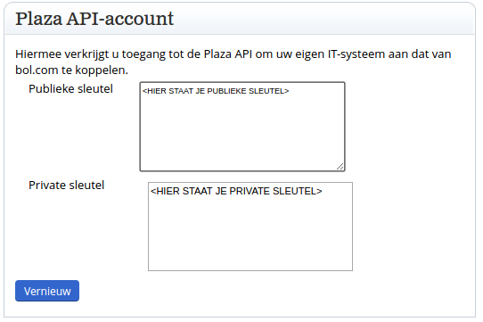
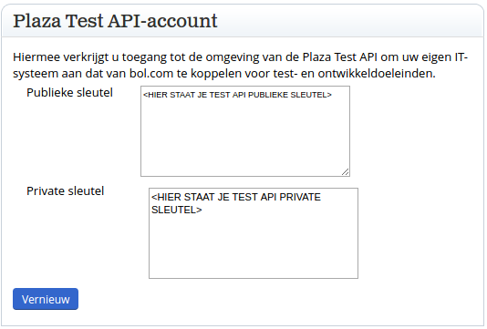
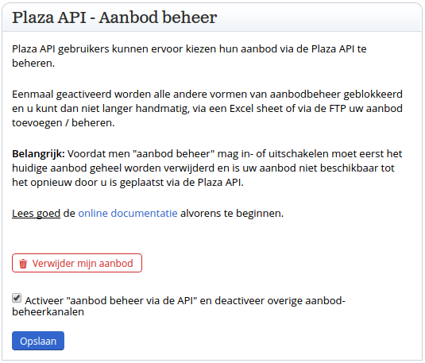

# Bol.com configuratie
De Bol.com configuratie moet ingesteld worden op uw [Bol.com verkopersaccount](https://www.bol.com/sdd/dashboard/dashboard.html)

## Profiel
Wanneer u klikt op de knop `Profiel bewerken` kunt u de instellingen van uw account aanpassen. De volgende instellingen moeten nagelopen worden.

### Plaza API-account
Hier vindt u de API sleutels die in de applicatie ingevoerd moeten worden.

***Dit zijn de live keys, gebruik deze dus pas nadat u de tests succesvol hebt doorlopen.***

### Plaza Test API-account
Hier vindt u de API sleutels voor de testverbinding. Begin met deze gegevens.

***Dit zijn de test API keys, begin hiermee!***

### Plaza API - Aanbod beheer
Met de Bol.com Plaza API connector module kunt u uw producten beheren vanuit Prestashop. Om dit te doen is het nodig om op Bol.com uw complete assortiment te verwijderen, waarna u het via Prestashop weer toe kunt voegen.

U kunt dit doen door op de rode knop `Verwijder mijn aanbod` te klikken. Houdt er rekening mee dat u dit pas doet wanneer u de tests succesvol hebt doorlopen.
Zet het vinkje bij `Activeer "aanbod beheer via de API" en deactiveer overige aanbod-beheerkanalen`, nu kunt u uw producten beheren via Prestashop. Let op: er zit een kleine vertraging in het activeren van de functionaliteit en het gebruik kunnen maken van de functies in Prestashop. Houdt rekening met 15 minuten vertraging.

***Het is aan te raden om eerst een Excel bestand van Bol.com te downloaden. Op die manier kunt u snel een backup terugzetten, mocht er iets toch niet goed verlopen.***

### Plaza API - Voorraad beheer

De Bol.com Plaza API connector module stuurt een bericht naar Bol.com wanneer de voorraad veranderd. U kunt er dus voor kiezen om uw voorraad zelf te beheren. Let op dat er dan wel een kleine vertraging tussen het afboeken en melden zit. U kunt het vinkje ook aan laten staan, maar dan kan voorraad dubbel afgeboekt worden.

