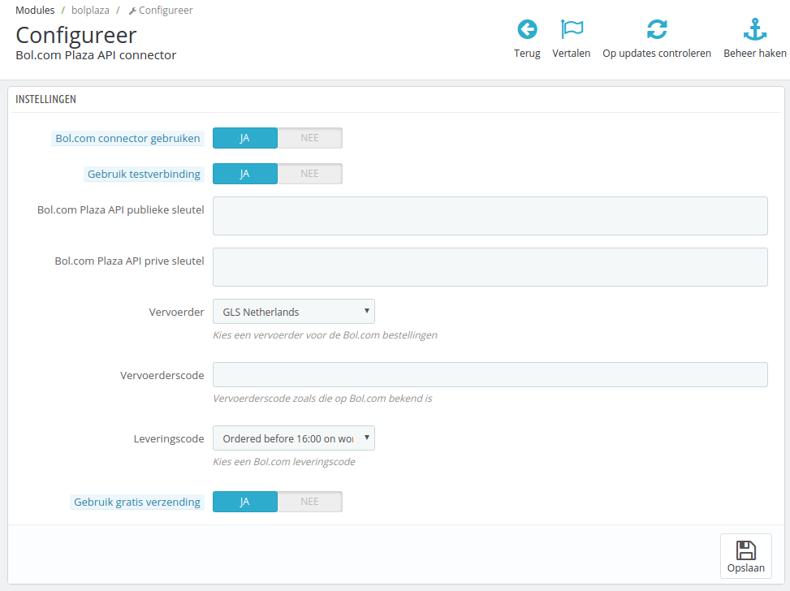

# Module configuratie
De module configuratie is te vinden in uw Prestashop installatie. Navigeer naar `Modules` -> `Modules en Services`, zoek de `Bol.com Plaza API connector` module en klik op `Configureer`.

U ziet nu het volgende formulier:

## Configureer de testverbinding
Het is zeer aan te raden om eerst een testverbinding te configureren. Ieder Bol.com verkopersaccount heeft toegang tot de test API. Daarin kan getest worden of de module in jouw Prestashop installatie goed werkt.

***Let er goed op dat u de Test API sleutels gebruikt voor de testverbinding***

Om de testverbinding te configureren kun vul je de volgende waardes in:

* Bol.com connector gebruiken: `JA`
* Gebruik testverbinding: `JA`
* Bol.com Plaza API publieke sleutel: [Uw publieke Test API sleutel](!Configuratie/Bol.com)
* Bol.com Plaza API prive sleutel: [Uw private Test API sleutel](!Configuratie/Bol.com)
* Vervoerder: `<uw vervoerder>`
* Vervoerderscode: `<bol.com vervoerderscode>`
* Leveringscode `<selecteer een levertijd>`
* Klantgroep: `Klant`
* Gebruik gratis verzending: `JA`
* Huisnummer in adres2: `NEE (Standaard) - Kies JA wanneer u het huisnummer bij de klantprofielen in het adres2 veld wilt zetten.`

De mogelijke vervoerderscodes kunt u vinden op de [Bol.com Plaza API website](https://developers.bol.com/documentatie/plaza-api/appendix-a-transporters/) in de kolom `API transporter code`. Hieronder staat een lijst met (momenteel) mogelijke codes. Let op dat de lijst van Bol.com altijd de meest actuele lijst is. Houdt er ook rekening mee dat de kolom `Available in API v2` op `yes` staat.

* DHLFORYOU
* UPS
* KIALA_BE
* KIALA_NL
* TNT
* TNT_EXTRA
* TNT_BRIEF
* TNT_EXPRESS
* DYL
* DPD_NL
* DPD_BE
* BPOST_BE
* BPOST_BRIEF
* BRIEFPOST
* GLS
* FEDEX_NL
* FEDEX_BE
* DHL
* DHL_DE
* DHL_GLOBAL_MAIL
* TSN
* FIEGE
* TRANSMISSION
* PARCEL_NL
* LOGOIX
* PACKS

## Live verbinding
Nadat u de testverbinding heeft geconfigureerd en de tests goed heeft uitgevoerd, kunt u de module configuren voor de productiemodus. Daarvoor hoeven maar een paar velden gewijzigd te worden:

* Gebruik testverbinding: `NEE`
* Bol.com Plaza API publieke sleutel: [Uw publieke API sleutel](../configuratie/bol.com.md)
* Bol.com Plaza API prive sleutel: [Uw private API sleutel](../configuratie/bol.com.md)

U bent nu klaar om orders te ontvangen. Lees in de gebruikersdocumentatie hoe dit werkt.

## Klantgroep
Het is aan te raden om een speciale klantgroep voor de Bol.com klanten te gebruiken. U kunt bij `Klanten` -> `Groepen` een nieuwe klantgroep aanmaken, in de module configuratie kunt u instellen dat deze klantgroep gebruikt dient te worden. De reden waarom het verstandig is om een aparte klantgroep te gebruiken, is zodat u de bestellingen voor Bol.com via aparte logica kunt laten verwerken. U kunt bijvoorbeeld de Catalogus Prijsregels van Prestashop gebruiken voor alle klantgroepen behalve de Bol.com klantengroep.
