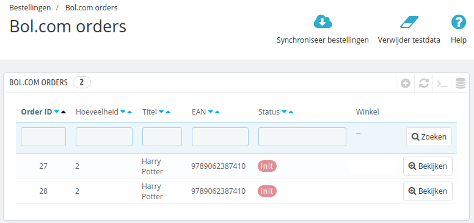
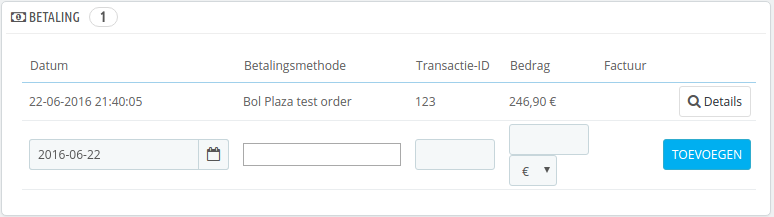
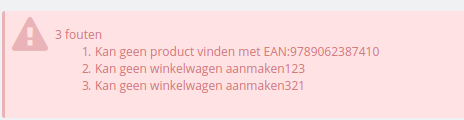

# Bol.com orders in Prestashop
Na het installeren van de module zijn er nieuwe opties in het menu van Prestashop gekomen. Een daarvan is `Bestellingen` -> `Bol.com orders`. Wanneer u daar naartoe navigeert, ziet u een overzicht van alle Bol.com bestellingen in het systeem.



## Orders overview
Navigeer naar `Bestellingen` -> `Bol.com orders`. Als het goed is ziet u bovenin de knop `Synchroniseer bestellingen`.

Met deze knop worden de bestellingen van Bol.com opgehaald en in uw systeem gezet. U kunt de bestelling vervolgens afhandelen via uw interne orderverwerkingsproces. U kunt op de order klikken om naar het Prestashop orderscherm te navigeren.

## Prestashop orderscherm
In het Prestashop orderscherm kunt u de Bol.com orderreferentie vinden in het paneel  `Betaling`.



U kunt in dit scherm een trackingnummer aan de order toevoegen, dit nummer zal naar Bol.com gemeld worden. Nadat het trackingnummer is gemeld, is de order in Bol.com gemarkeerd als verwerkt.

## Mogelijke fouten
Bij het synchroniseren is het mogelijk dat er een fout wordt gegeven. Hier vindt u een overzicht.

### Kan geen product vinden


De foutmelding `Kan geen product vinden met EAN:XXXXX` wordt veroorzaakt doordat er geen product is met het EAN nummer dat door Bol.com is teruggemeld. Maak een product aan met dit nummer en synchroniseer de orders opnieuw. De overige fouten (`Kan geen winkelwagen aanmakenXXX`) worden veroorzaakt door de eerste fout.

### Waarschuwing bij importeren van meerdere orders
De waarschuwing komt door een bug in Prestashop core, het probleem kan geen kwaad, maar er is een [bug report](http://forge.prestashop.com/browse/PSCSX-7858) gemaakt. U kunt de waarschuwing verwijderen door handmatig een override class te maken voor de Cart class (zie code block hiernaast/onder).

```php
/**
 * Get the delivery option selected, or if no delivery option was selected,
 * the cheapest option for each address
 *
 * @param Country|null $default_country
 * @param bool         $dontAutoSelectOptions
 * @param bool         $use_cache
 *
 * @return array|bool|mixed Delivery option
 */
public function getDeliveryOption($default_country = null, $dontAutoSelectOptions = false, $use_cache = true)
{
    static $cache = array();
    $cache_id = (int)(is_object($default_country) ? $default_country->id : 0).'-'.(int)$dontAutoSelectOptions.'-'.$this->id;
    if (isset($cache[$cache_id]) && $use_cache) {
        return $cache[$cache_id];
    }

    $delivery_option_list = $this->getDeliveryOptionList($default_country);

    // The delivery option was selected
    if (isset($this->delivery_option) && $this->delivery_option != '') {
        $delivery_option = Tools::unSerialize($this->delivery_option);
        $validated = true;
        foreach ($delivery_option as $id_address => $key) {
            if (!isset($delivery_option_list[$id_address][$key])) {
                $validated = false;
                break;
            }
        }

        if ($validated) {
            $cache[$cache_id] = $delivery_option;
            return $delivery_option;
        }
    }

    if ($dontAutoSelectOptions) {
        return false;
    }

    // No delivery option selected or delivery option selected is not valid, get the better for all options
    $delivery_option = array();
    foreach ($delivery_option_list as $id_address => $options) {
        foreach ($options as $key => $option) {
            if (Configuration::get('PS_CARRIER_DEFAULT') == -1 && $option['is_best_price']) {
                $delivery_option[$id_address] = $key;
                break;
            } elseif (Configuration::get('PS_CARRIER_DEFAULT') == -2 && $option['is_best_grade']) {
                $delivery_option[$id_address] = $key;
                break;
            } elseif ($option['unique_carrier'] && in_array(Configuration::get('PS_CARRIER_DEFAULT'), array_keys($option['carrier_list']))) {
                $delivery_option[$id_address] = $key;
                break;
            }
        }

        reset($options);
        if (!isset($delivery_option[$id_address])) {
            $delivery_option[$id_address] = key($options);
        }
    }

    $cache[$cache_id] = $delivery_option;

    return $delivery_option;
}
```


### Ik kan geen producten importeren die niet op voorraad zijn
Dit kan wel, maar dan moeten de producten wel bestelbaar zijn (dus ook op uw website). U kunt deze functionaliteit veranderen door een override class aan te maken voor Product, en daarin de volgende code te zetten (zie hiernaast/onder)

```php
public static function isAvailableWhenOutOfStock($out_of_stock)
{
    // @TODO 1.5.0 Update of STOCK_MANAGEMENT & ORDER_OUT_OF_STOCK
    static $ps_stock_management = null;
    if ($ps_stock_management === null) {
        $ps_stock_management = Configuration::get('PS_STOCK_MANAGEMENT');
    }

    if (!$ps_stock_management || isset(Context::getContext()->employee)) {
        return true;
    } else {
        static $ps_order_out_of_stock = null;
        if ($ps_order_out_of_stock === null) {
            $ps_order_out_of_stock = Configuration::get('PS_ORDER_OUT_OF_STOCK');
        }

        return (int)$out_of_stock == 2 ? (int)$ps_order_out_of_stock : (int)$out_of_stock;
    }
}
```
