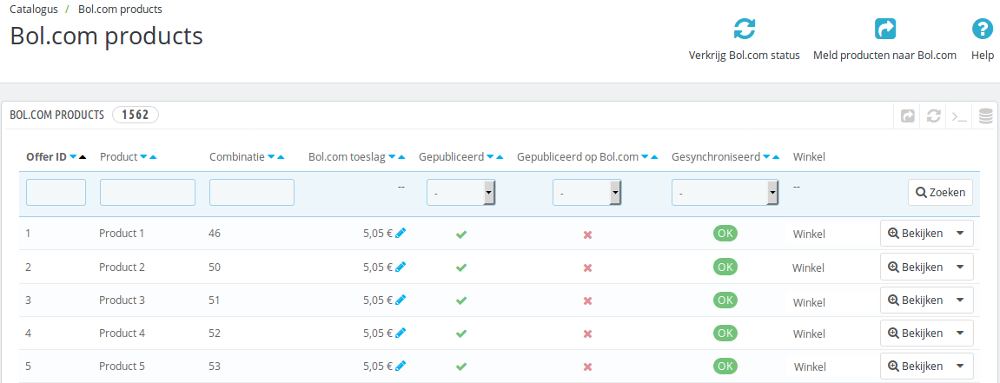
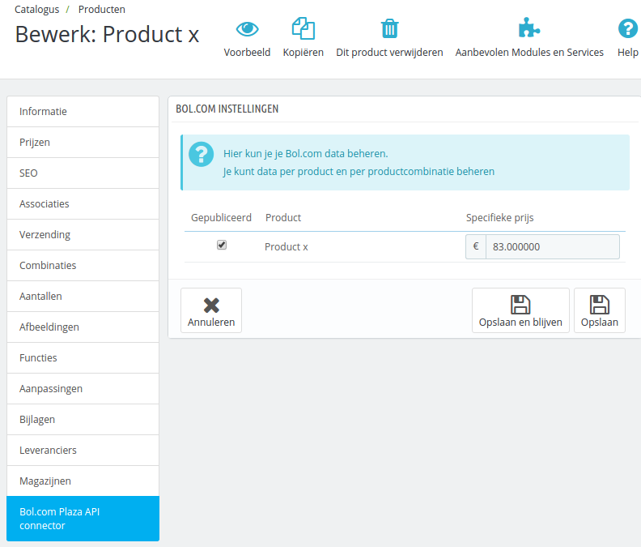

# Prestashop producten op Bol.com
Na het installeren van de module zijn er nieuwe opties in het menu van Prestashop gekomen. Een daarvan is `Catalogus` -> `Bol.com producten`. Wanneer u daar naartoe navigeert, ziet u een overzicht van alle producten in het systeem die op Bol.com gepubliceerd worden.



## Producten selecteren
Binnen Prestashop kunt u nu per product instellen hoe deze op Bol.com weergegeven dient te worden. Op de product bewerkpagina (onder `Catalogus`) vindt u een tab met de titel `Bol.com Plaza API connector`. Op die tab staan de instellingen voor Bol.com.



Op deze tab ziet u voor alle productcombinaties een optie om deze te publiceren (via het vinkje onder `Published`). Ook kunt u per combinatie een Bol.com geadverteerde prijs instellen (in het veld `Price change`). Klik voor een product aan dat deze op Bol.com gepubliceerd moet worden.

Per product zijn de volgende instellingen mogelijk:

- `Published` - Het product moet gepubliceerd worden op Bol.com
- `Price change` - Berekent de eindprijs aan de hand van een bepaalde opslag
- `Final price` - Berekent de opslag aan de hand van een bepaalde eindprijs. De opslag wordt opgeslagen in de database.

Nadat u op de regel klikt, kunt u nog meer instellingen doen:

- `Condition` - Hier kunt u de productconditie aangeven (bijvoorbeeld voor 2e hands producten)
- `EAN` - Hier kunt u een EAN override instellen, normaal gesproken staat de standaard EAN in ingevuld
- `Custom Delivery time` - Een override voor de levertijd van het specifieke product

Verder ziet u
- `Proposed price` - Klik op de prijs om deze in te stellen, of klik op `-- Select --` om dit voor alle producten in te stellen.
- `Base price` - De prijs van het product in uw webshop


## Producten synchroniseren
Wanneer er een nieuw product wordt geselecteerd voor Bol.com, wordt deze direct naar Bol.com gemeld. Daarmee komt de status van dat product op `OK`. U kunt de status van de productsynchronisatie inzien op de `Catalogus` -> `Bol.com products` pagina. Indien de melding naar Bol.com mislukt, staat de status nog op `Nieuw`.

De volgende statussen zijn mogelijk voor een Bol.com publicatie:

* `OK` - Dit product is correct naar Bol.com gemeld
* `Nieuw` - Dit product is nieuw en nog niet naar Bol.com gemeld
* `Voorraad bijgewerkt` - Van dit product is de voorraad bijgewerkt, maar nog niet naar Bol.com gemeld
* `Info bijgewerkt` - Van dit product is de informatie bijgewerkt, maar nog niet naar Bol.com gemeld

Als er in het productenoverzicht een andere status dan `OK` staat, kan via de knop `Synchroniseer producten` bovenin de synchronisatie handmatig worden gestart. Indien er foutmeldingen ontstaan tijdens de synchronisatie krijgt u een bericht. Wanneer de API onbeschikbaar is kunt u het later nog eens proberen, maar als er foutieve data gestuurd is, moet u de produten wellicht aanpassen.

U kunt per product selecteren dat deze opnieuw naar Bol.com moet worden gemeld. Dit doet u door op de zijkant van de knop te drukken, daar kunt u de status wijzigen naar een nieuwe status.

## Veelgestelde vragen

### Hoe zet ik een afbeelding bij een product?

Helaas is deze functie nog niet beschikbaar via de Plaza API van Bol.com. U kunt alleen nieuwe producten toevoegen via de Bol.com interface. Daar kunt u ook uw productinformatie beheren (zoals afbeeldingen).

### Moet ik alle producten handmatig langslopen?

Indien u toegang hebt tot de database kunt u de producten ook direct in de tabel toevoegen. U dient daarna nog wel de synchronisatie handmatig aan te zetten. Hieronder staat een (voorbeeld) van een SQL query om de producten te selecteren. In deze situatie is er een Database Prefix van `ps_` gebruikt en een shop ID van `1`, deze gegevens moet wellicht voor uw situatie aangepast worden.

 - In de voorbeeldqueries wordt er gebruik gemaakt van een BTW tarief van 21% (1.21 in de query)
 - In de voorbeeldqueries wordt er gebruik gemaakt van een prijsverhoging van € 5,= (5 in de query)
 - In de voorbeeldqueries wordt er gebruik gemaakt van een prijsverhoging (vermenigvuldigingsfactor) van 20% van (1.20 in de query)
 - In de voorbeeldqueries wordt er afgerond op € 0,10 cent (2x 0.1 in de query)

Verwijder eerst alle huidige Bol.com producten uit de tabel

    DELETE FROM ps_bolplaza_product WHERE id_bolplaza_product > 0;


Voeg de bestaande producten (zonder combinaties) toe
```sql
INSERT INTO ps_bolplaza_product (id_product, id_product_attribute, id_shop, ean, condition, published, price, status)
SELECT p.id_product, 0 as id_product_attribute, s.id_shop, p.ean13, 0 as condition, 1 as published, CEIL(((((p.price * 1.21) + 5) * 1.20) - (p.price * 1.21)) / 0.1) * 0.1 as price, 1 as status
FROM ps_product p
LEFT JOIN ps_product_shop s on s.id_product = p.id_product
LEFT JOIN ps_product_attribute a ON a.id_product = p.id_product
WHERE s.id_shop = 1 AND a.id_product_attribute IS NULL
```

Voeg de combinaties toe
```sql
INSERT INTO ps_bolplaza_product (id_product, id_product_attribute, id_shop, ean, condition, published, price, status)
SELECT p.id_product, a.id_product_attribute, s.id_shop, a.ean13, 0 as condition, 1 as published, CEIL((((((p.price + a.price) * 1.21) + 5) * 1.20) - ((p.price + a.price) * 1.21)) / 0.1) * 0.1 as price, 1 as status
FROM ps_product p
LEFT JOIN ps_product_shop s on s.id_product = p.id_product
LEFT JOIN ps_product_attribute a ON a.id_product = p.id_product
WHERE s.id_shop = 1 AND a.id_product_attribute IS NOT NULL
```
