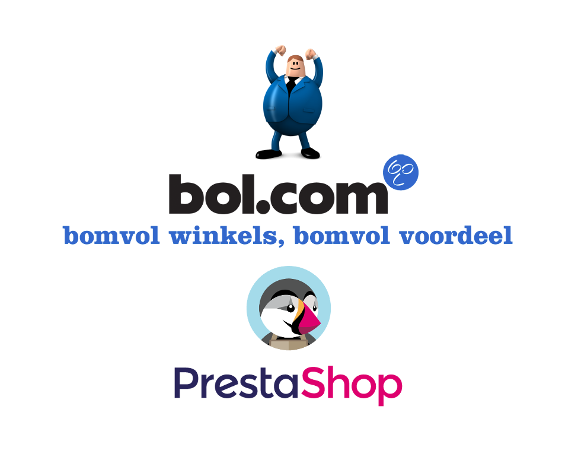

# Bol.com Plaza API connector

De **Bol.com Plaza API connector** is een module om Prestashop met Bol.com te verbinden. De module geeft de mogelijkheid om orders en producten te synchroniseren tussen uw Prestashop installatie en uw Bol.com verkopersaccount.

## Installatie

Schaf de module aan op de [Prestashop addons store](http://addons.prestashop.com/en/22376-bolcom-plaza-api-connector.html). Wanneer uw Prestashop instantie is verbonden met uw addons account, kunt u de module nu in uw backoffice vinden. U kunt ook het zip bestand van de addons website downloaden en via de interface naar uw website uploaden.

Modules beheren werkt via uw Prestashop administratie, via het menu `Modules` > `Modules & Services`.

Rechtsboven staat een knop `Nieuwe module toevoegen`, waar u het zipbestand kunt uploaden. Na een succesvolle installatie ziet u de [Module configuratiepagina](configuratie/module.md).
