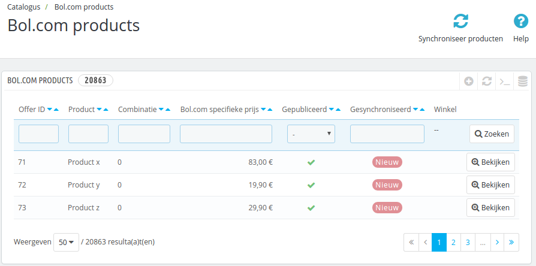
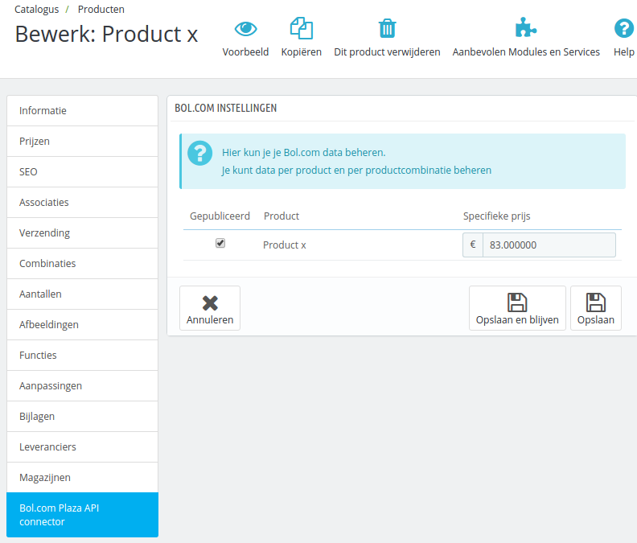

# Producten testen
De tweede test die uitgevoerd dient te worden is de producten synchronisatie. Deze test is alleen van belang wanneer u uw producten wilt synchroniseren via Bol.com (en dus geen Excel bestand meer wilt gebruiken).

***Kijk goed na of u de module in [testmodus heeft geconfigureerd](../configuratie/module)***

Na het installeren van de module zijn er nieuwe opties in het menu van Prestashop gekomen. Een daarvan is `Catalogus` -> `Bol.com producten`. Wanneer u daar naartoe navigeert, ziet u een overzicht van alle producten in het systeem die op Bol.com gepubliceerd worden.

## Producten selecteren
Binnen Prestashop dient u per product in te stellen hoe deze op Bol.com weergegeven dient te worden. Op de product bewerkpagina (onder `Catalogus`) vindt u een nieuwe tab met de titel `Bol.com Plaza API connector`. Op die tab staan de instellingen voor Bol.com.

Op deze tab ziet u voor alle productcombinaties een optie om deze te publiceren (via het vinkje onder `Publiceren`). Ook kunt u per combinatie een Bol.com geadverteerde prijs instellen (in het veld `Specifieke prijs`). Klik voor een product aan dat deze op Bol.com gepubliceerd moet worden.

## Producten synchroniseren
Wanneer er een nieuw product wordt geselecteerd voor Bol.com, wordt deze direct naar Bol.com gemeld. Daarmee komt de status van dat product op `OK`. U kunt de status van de productsynchronisatie inzien op de `Catalogus` -> `Bol.com products` pagina. Indien de melding naar Bol.com mislukt, staat de status nog op `Nieuw`. Controleer of alles goed is gegaan door te controleren of het product in het overzicht op status `OK` staat.

Als er een status nieuw staat kunt u de knop `Synchroniseer producten` bovenin gebruiken om de producten te synchroniseren. De module zal de gewijzigde produten opnieuw aan Bol.com proberen aan te bieden.

## Testdata verwijderen
In het `Bewerk product` scherm kunt u het vinkje bij `Publiceren` verwijderen en `Specifieke prijs` op 0 zetten. Hiermee wordt het product van Bol.com verwijderd.
